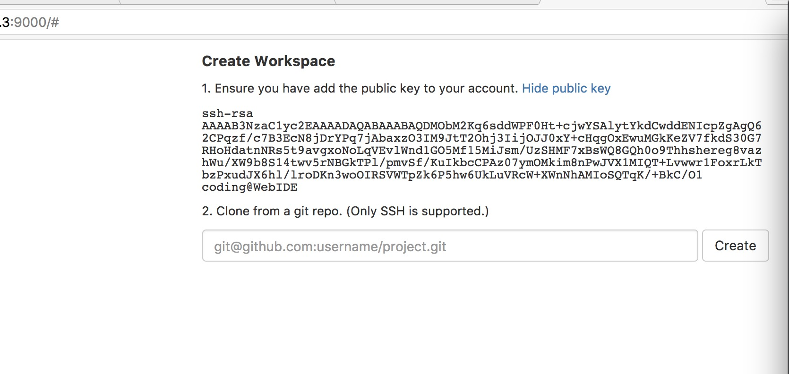

# cwebide

--- 

### 说明:

基于[coding.net](http://coding.net) 的WebIde 修改，构建基于centos 的webide ，构建灵活，方便运行，更容易扩展。

### 构建镜像方法:

docker build . -t cwebide

### 运行方法:

docker run -d -p <localip>:<localport>:8080 cwebide

** 注意，使用本地IP 创建运行起来的webide ，否则，整个容器将暴露在公网，坏人就可以为所欲为了。**

### 成功运行截图:

### 谢谢使用!

